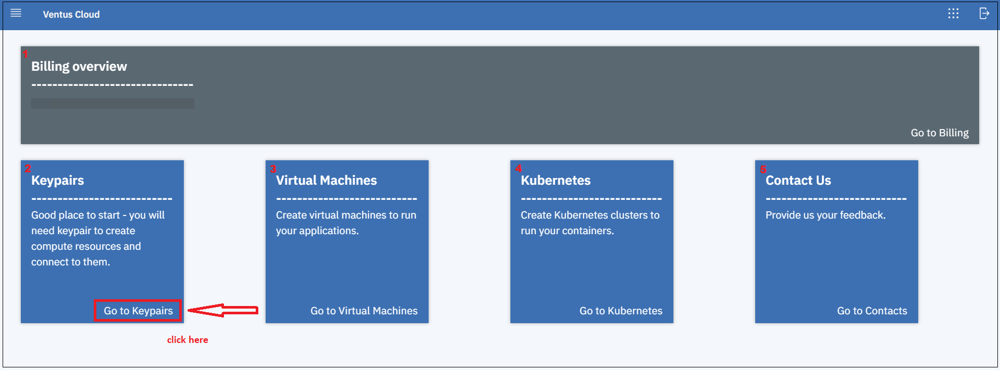
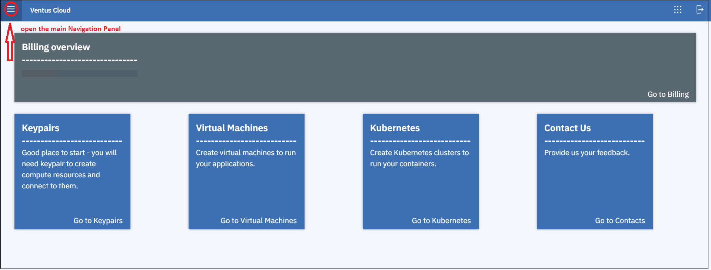
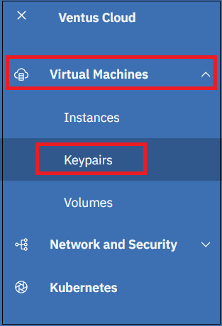
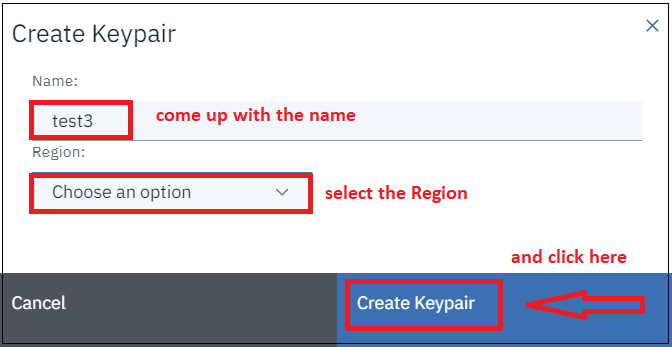
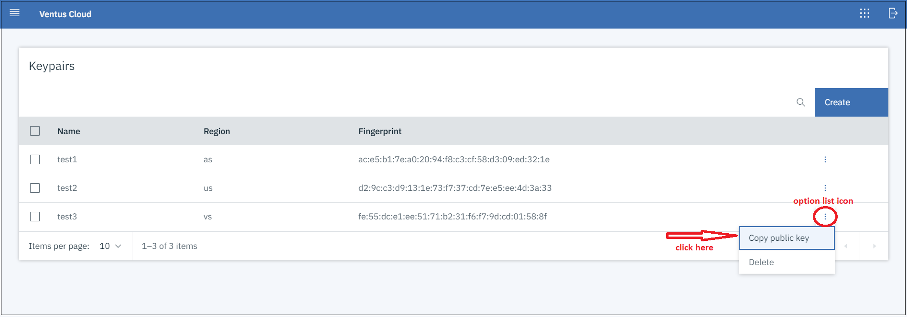
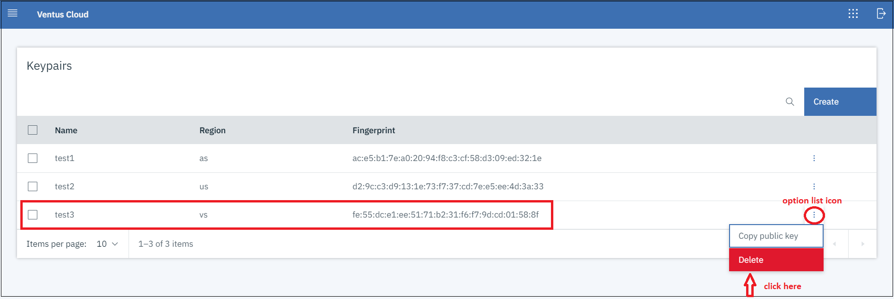

# SSH Keypairs
{: .no_toc }
---
In this page, you can find an explanation of how to generate a new SSH Keypairs, as well as how to use and manage it in Ventus Cloud Portal.

## Table of contents
{: .no_toc .text-delta }

1. TOC
{:toc}

## Open the Keypairs page

You have to ways how to get to the *Keypairs page*:

`First one:` **Through the *Home Page*:**  
On the *Homepage* you can see 5 blocks, each of which contains information about the main services provided by Ventus Cloud.  
You need to select the block named *Keypairs* and click `Go to Keypairs`. This action will redirect you to the *Keypairs page*.
    
 
`Second one:` **Through the main *Navigation Panel*:**
To find the main *Navigation Panel* click the `menu` icon in the upper left corner of the *Home Page*:  
     

Then on the main *Navigation Panel* go to `Virtual Machines` and choose `Keypairs`. So this action will also redirect you to the *Keypairs page*.    
   

On this page you can find all created SSH Keypairs with their details area.  
**Keypairs details area includes:** 
`Name`: Shows the name for the Keypairs;  
`Region`: Shows which region the corresponding key pairs belong to;  
`Fingerprint`: Shows each Public Key fingerprint which is a sequence of bytes used to identify a longer public key. Fingerprints are created by applying a cryptographic hash function to a Public Key;
`option list icon`: Opens a list of available management actions for the selected Keypairs.
  

## Create a new SSH Keypair

To create a new SSH Keypairs go to the *Keypairs page* and  click the `CREATE` icon in the the upper right corner.  
    

*On the next page you need:*
1) to fill the next fields: 
    `Name`: in this field you set a name for the Keypair;    
    `Region`: here you specify which region this Keypair will belong to.  

2) to click `Create Keypair` after filling the specified fields.  
  

The next open page will provide your *Private Key* and you need to click the `Copy private key` icon here and save it to your server, otherwise it will not be saved.  
  

After that the newly created SSH Keypair will be added to the *Keypairs page*.

 



## Copy Public Key
To Copy Public Key you need:
* click the `option list` icon;
* select `Copy public key` in the list of available options:

## Delete a Keypair
To remove a SSH Keypair you need:
* to identify this unnecessary Keypair on the *Keypair page*;  
* click the `option list` icon;
* select `Delete` in the list of available options:

After confirming your action on the next page, the selected SSH Keypair will be deleted.

