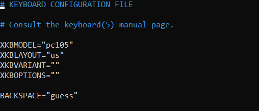
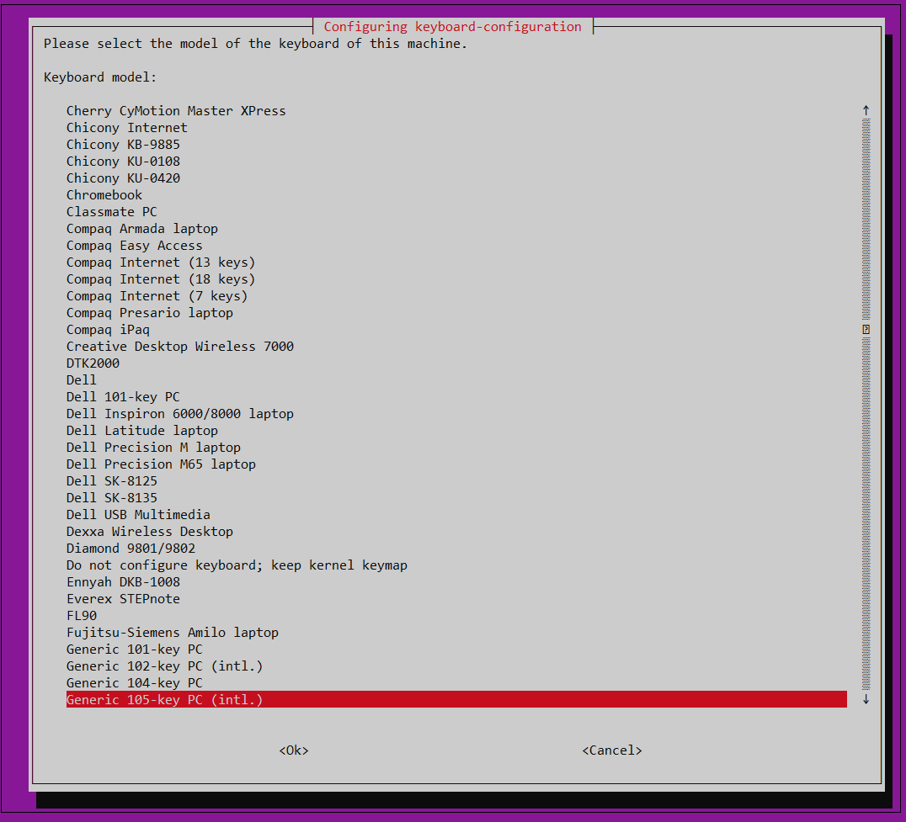
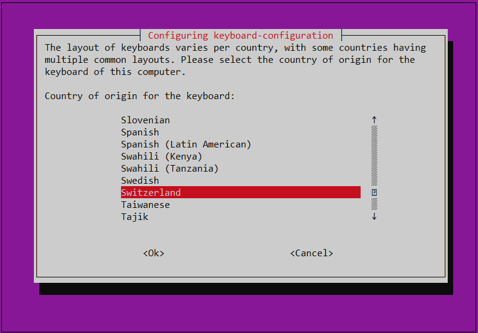
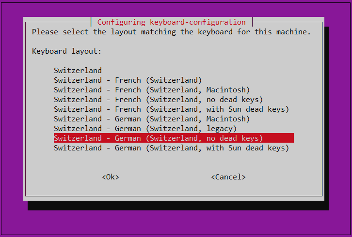
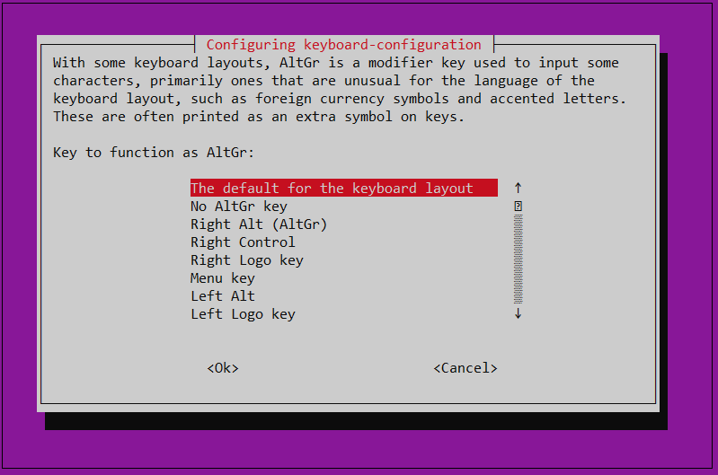
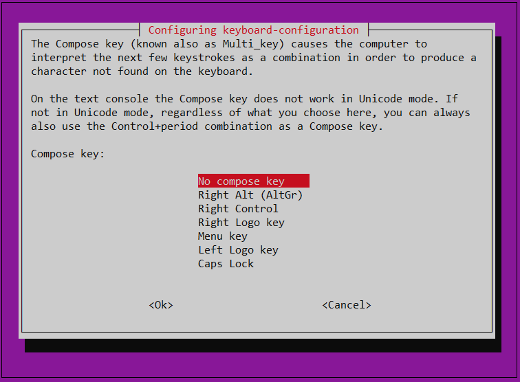

# Linux Virtual Machines 
{: .no_toc }
---
On this page, you can find an explanation of how to create and manage Linux Virtual Machine in Ventus Cloud Portal.

## Table of contents
{: .no_toc .text-delta }

1. TOC
{:toc}

## Open the Virtual Machines page

You have to ways how to get to the *Virtual Machines page*:

`First one:` **Through the *Home Page*:**    
On the *Homepage* you can see 5 blocks, each of which contains information about the main services provided by Ventus Cloud.    
You need to select the block named *Virtual Machines* and click `Go to Virtual Machines`. And this action will redirect you to the *Virtual Machines page*.  
    

For creating new instance do the following:

1. On the main Navigation Panel go to **Cloud**, choose **Instances** and click the plus (+) button from at the bottom-right of the screen.

  
  

2. On the following page fill in these fields:

- _Instance Name_:
  This will set the name in the Ventus database. The hostname inside the instance will not be set.(eg. "Test1")

  

- _Select a Boot source_:
  Select the image to boot from, from the list of available images. You can also boot from an instance snapshot if any is available. (eg. "ubuntu-server-18.04-LTS-20200131.1")

- _Select storage type_:
  Select storage type "RBD" and provide preferred disc size

  

- _Select a configuration_:
  Configurations (flavors) hold information about the Instance memory, disk space and the number of virtual CPUs that will be available. (eg. "VC-2")

  

- _Network selection_:
  Select network (public or private)

- _Select a SSH Key_:
  A SSH key which you previously added in SSH keys page. Also, you can add your own key or generate a new one to use - cklick the button **Add a new key**, assign a name and click the button **Generate key**.
  This field is optional,you can leave none selected.

  

- _Root Password_:
  You can view your typed password by clicking on the eye icon from right. The password should be at least 8 characters long and should contain at least one digit, letter or symbol.

  

3. Hit **Create Instance** and the new instance will be created.

  

**For example, see a quick recap**  
  

## View instance details
---



Instance details area:

- _OS Icon_: Shows instance operating system icon (Centos, Ubuntu, etc.)
- _Instance name_: Could be different from the hostname inside the instance.
- _Instance status_: Depending on the instance state, it could be: Running, Stopped, Mounting, Rescued, etc.
- _Quick actions_: Used for: Shutdown/Start, Restart, Launch Console, More (Rescue, Rebuild, Rename, Resize, Change password, Delete).
- _Instance tab menu_: Access to following subpages: Info, System Log, Metrics, Snapshots, Volumes, History Log, Security Groups
- _Specification_: Details about instance (installed image, flavor, RAM, CPUs, disk space)
- _Network_: Details about network (private and public IPs)
- _Other_: Other details like instance unique number and instance data creation.

  

## Search for an instance
---

To search for an instance, type your instance name in the search box from the top of the instance page.

  

## Start / Shutdown / Reboot instance
---

There are two ways in interface for **Start / Shutdown / Restart** your instance:

First one is directly from instance page. In each instance box, there is one icon for **Start/Shutdown** and one icon for **Restart**. See next image for reference:

  

Second way is from instance details (click on the instance you want)and there you will find, in the top-right of the instance window, one icon for Start/Shutdown and one icon for Restart, as you can see below:

  

## Login into console
---

You can launch the web-console window directly from instance page or from instance details. Click on the icon _<>_ for launching the web-console.  
After the new window with the web-console will appear, you can login into your VPS with your user details and start working.  
You can also connect to your instance through another Terminal using the SSH protocol and instance-IP:

```
ssh <IP of instance>
```

## Configure keyboard
---

Linux VMs (in our case it's Ubuntu 18.04) come with many keyboard layouts that you can choose from depending on the Language and region. The default language is `us` but you can change it if you need.  

Keyboard Layout is based on the following XKB parameters, found in `/etc/default/keyboard` file. By default it looks like shown below:    
  

- **XkbModel** - This parameter defines the XKB model name. The default is `pc105`;  
- **XkbLayout** - This attribute specifies the XKB keyboard model name, more specifically the Country & Language type of the keyboard. The default language is `us`;  
- **XkbVariant** - This defines the variant components of XKB keyboard. These are used in further specifying the layout details.  
- **XkbOptions** - This specifies the keyboard's extra functionalities or options such as the behavior of special keys e.g SHIFT, CTRL, ALT, ESC etc.  


_If you wish to change the keyboard configuration, run:_
```
dpkg-reconfigure keyboard-configuration
```

This opens a screen with a list of possible keyboard layouts as shown below:  
  

Next, you'll be required to select the Language and Country:    
  

Select Matching keyboard:  
  

On the next step select key to function as AltGr:    
  

And on the last step choose compose key:  
  

Now your keyboard is configured and your `/etc/default/keyboard` file looks like below:  
  

## Manage an instance
---

The icon **More** is responsible for managing an instance
So whith this icon **More**, you can:

- **Rescue instance** (recover your data)
- **Rebuild instance** (reinstall instance)
- **Rename instance**
- **Resize instance** (upgrade CPU, RAM, HDD)
- **Change root password**


## Delete instance
---

If you want to delete an instance click the icon **More** and select **Delete**

  

