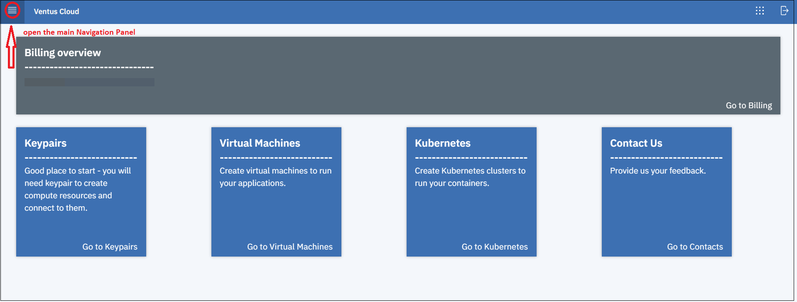

# Linux Virtual Machines 
{: .no_toc }
---
On this page, you can find an explanation of how to create and manage Linux Virtual Machine in Ventus Cloud Portal.  
  

## Table of contents
{: .no_toc .text-delta }

1. TOC
{:toc}

## Open the Instances page

You have to ways how to get to the *Instances page*:

`First one:` **Through the *Home Page*:**    
On the *Homepage* you can see 5 blocks, each of which contains information about the main services provided by Ventus Cloud.    
You need to select the block named *Virtual Machines* and click `Go to Instances`. And this action will redirect you to the *Instances page*.  
    

`Second one:` **Through the main *Navigation Panel*:**  
To find the main *Navigation Panel* click the `menu` icon in the upper left corner of the *Home Page*:    
       

Then on the main *Navigation Panel* go to `Virtual Machines` and choose `Instances`. So this action will also redirect you to the *Instances page*.    
    

On this page you can find all created Instances with their details area.  