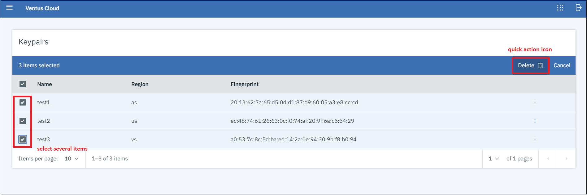

# SSH Keypairs 
{: .no_toc }
---
On this page, you can find an explanation of how to generate a new SSH Keypairs, as well as how to use and manage it in Ventus Cloud Portal.

## Table of contents
{: .no_toc .text-delta }

1. TOC
{:toc}

## Open the Keypairs page

You have to ways how to get to the *Keypairs page*:

`First one:` **Through the *Home Page*:**    
On the *Homepage* you can see 5 blocks, each of which contains information about the main services provided by Ventus Cloud.    
You need to select the block named *Keypairs* and click `Go to Keypairs`. This action will redirect you to the *Keypairs page*.  
    
   
`Second one:` **Through the main *Navigation Panel*:**  
To find the main *Navigation Panel* click the `menu` icon in the upper left corner of the *Home Page*:    
       

Then on the main *Navigation Panel* go to `Virtual Machines` and choose `Keypairs`. So this action will also redirect you to the *Keypairs page*.    
    

On this page you can find all created SSH Keypairs with their details area.  

**Keypairs details area includes:**   
`Name`: Shows the name of the Keypairs;    
`Region`: Shows which regions the corresponding Keypairs belong to;    
`Fingerprint`: Shows each Public Key fingerprint which is a sequence of bytes used to identify a longer public key;  
`option list icon`: Opens a list of available management actions for the selected Keypair.  
    

## Create a new SSH Keypair

To create a new SSH Keypair go to the *Keypairs page* and  click the `CREATE` icon in the the upper right corner.    
      

*On the next page you need:*    
1) to fill the next fields:     
    `Name`: in this field you set a name for the Keypair;    
    `Region`: here you specify which region this Keypair will belong to.    

2) to click `Create Keypair` after filling the specified fields.  
    

The next open page will provide your *Private Key* and you need to click the `Copy private key` icon here and save it to your server, otherwise it will not be saved.    
  

After that the newly created SSH Keypair will be added to the *Keypairs page*.  

 



## Copy Public Key

To Copy Public Key you need:  
* click the `option list` icon;  
* select `Copy public key` in the list of available options:  
  

## Delete a Keypair  

To remove a SSH Keypair you need:  
* to identify this unnecessary Keypair on the *Keypair page*;    
* click the `option list` icon;  
* select `Delete` in the list of available options:  
  

After confirming your action on the next page, the selected SSH Keypair will be deleted.  
    

You can also select several Keypairs and remove them with one click on the corresponding `quick action` icon that appears at the top of the page after selecting the appropriate Keypairs:  
    
